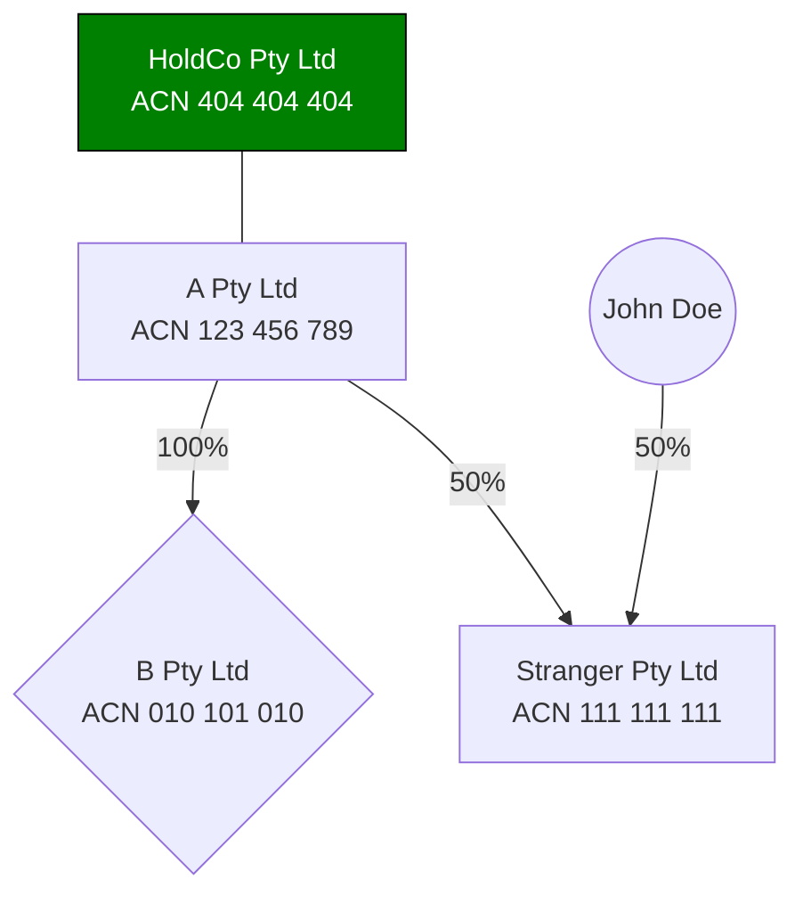
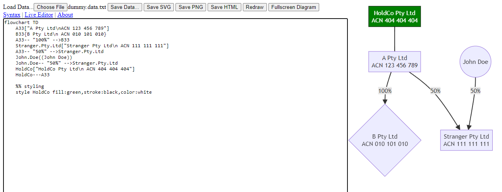

Simple, Auditable and Offline Mermaid.js Editor

# Usage
Usage should be intuitive. 

1. Download `index.html`
   1. For a fully-offline experience, also download the `mermaid.min.js` file and change the `<script src="...">` reference to point to the local library
2. Load a data file from your computer or, if you don't have one, start editing in the text box on the left
3. Your progress is **not** saved automatically. *However*, the page will warn you when you try to leave or refresh it. This safeguard should work unless you manually kill your browser's process.
4. However, you can *save* your work (the data file) any time you wish using either the `^S` shortcut or the `Save Data` button. 
   1. The save behaviour depends on your browser. In the latest Chrome-derived browsers, you can use a fancy `Save As` dialogue. Once you have saved a file for the first time, you can continue saving into it, or you can `SHIFT+CLICK` the save button to re-open the `Save As` dialogue and save to a different location.
   2. On other browsers, you will use the 'legacy' method. With this method:
      1. If you loaded a data file previously, the name of the data file will be used when saving.
      2. If you did not load a data file, you will be prompted to supply a filename.
      3. The file will be saved to your default Downloads folder.
      4. Note that successive files will be saved with a `(n+1)` filename. The current implementation does not permit working with local files on your computer so the saved file is treated as a duplicate.
5. The diagram will be rendered as you type or load files. You can also force redraw by using the `Redraw` button. If no diagram is rendered, there is likely a syntax error in your diagram definition. Check the browser console (`CTRL+SHIFT+I`) or the place where the image should have rendered.
6. The resulting diagram can be saved in the following formats:
   1. SVG (scaleable vector graphic): will work with Adobe Illustrator, Inkscape, et cetera. SVG is preferred because it is a vector image that will scale without blurriness or losing aspect ratio on differnet screen sizes. SVGs can be viewed with any modern browser.
   2. PNG: this is the usual image format you would be familiar with alongside the `jpg`. 
   3. HTML: like the SVG option above, but includes a tiny HTML wrapper making the diagram a webpage. I'm not sure why you'd necessarily want this, but it exists if you do.

Above the editor, there is a helpful link to the `Mermaid.js` flowchart syntax (with code and visual examples). The TL;DR cheatsheet is:

* Start with a diagram definition and direction, such as `flowchart TB`. 
* You can define entities by giving them an ID such as `A33`, `John.Doe`, etc (no spaces, though). Following the ID, you can define the shape using characters such as `[]` (for squares), `{}` (for rhombus) and `(())` (for circles) and you can include a human-friendly name inside the brackets. If you want complex strings, use quotes.
* Define connections between nodes using dashes between IDs, like so: `A33---John.Doe`
* You can label connections like so: `John.Doe-- "100%; 1 share" -->A33`
* Comments start with `%%`
* You can pass css style information with `style <id> <css...>`

Working example:

```
flowchart TD
    A33["A Pty Ltd\nACN 123 456 789"]
    B33{B Pty Ltd\n ACN 010 101 010}
    A33-- "100%" -->B33
    Stranger.Pty.Ltd["Stranger Pty Ltd\n ACN 111 111 111"]
    A33-- "50%" -->Stranger.Pty.Ltd
    John.Doe((John Doe))
    John.Doe-- "50%" -->Stranger.Pty.Ltd
    HoldCo["HoldCo Pty Ltd\n ACN 404 404 404"]
    HoldCo---A33

    %% styling
    style HoldCo fill:green,stroke:black,color:white

```





# TODO/Features

* [x] Must be completely offline with no external network dependencies\* and communications; 
* [x] Must be able to run out of a `file://` URL without the need of a web server. If it works as a PWA, great. But fallback to basics must still work.
* [x] Code should be easily auditable: I won't set an arbitrary 200-line limit, but the basic idea is that a busy sysadmin should be able to read it and realize that it doesn't cause any harm. 
* [x] I am thinking of a two-panel design: one panel is a code editor box, the second panel is the output/live preview. 
* [ ] The editor:
  * [x] Can have some controls (load data/save data/save diagram as image/take diagram fullscreen)
  * [ ] Syntax highlighting is a bonus but not a must
    * Implementing syntax highlighting will add extra complexity. Will need to move from a simple textarea to a `contenteditable` block. This will complicate loading/saving data. 
    * Note that the Mermaid Live Editor uses an instance of VS Code with their plugin enabled. This is too much complexity for this project.  
  * [x] File System Access API is a bonus but not a must
  * [x] Should be able to do live redraws of the preview (or, at least, button-prompted)
  * [x] Should support data save/load
  * [x] A 'are you sure you want to leave'? prompt would be good
* [ ] The output:
  * [ ] Should have pan/zoom

# Why? 
I am legally blind. I find it much easier to define diagrams in markup than to draw them by hand or by using MS Word/Excel (in the absense of specialist diagraming programs like MS Visio or Dia). 
I found myself needing to generate diagrams in a corporate environment where: 
* I cannot install tools I would otherwise want to use; and
* No corporate data should leave the corporate network. 

A reputable JavaScript Library that can be run client-side out of the box seemed like the best solution.
`Mermaid.js` seemed perfect for the job. it even has a Live Editor that promises to be completely client-side and keep the data local. However, the Live Editor has got more features than I necessarily need (and, consequently, is harder to audit). 
This code is a very simplistic alternative to the Live Editor that currently sits at <360 lnes of code and can be easily audited.

# License
Mermaid.js is MIT licensed.

This code is also MIT Licensed ©️ Nikita Sosnik 2024. 
